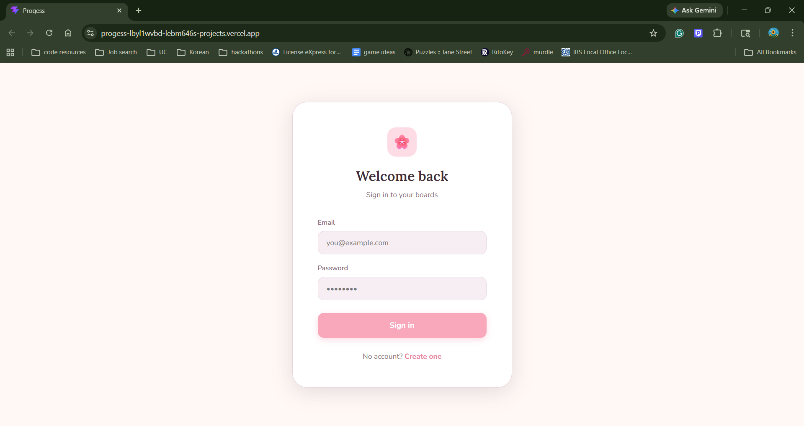
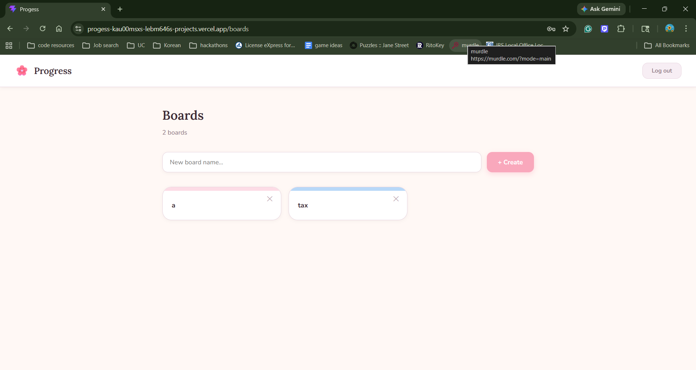
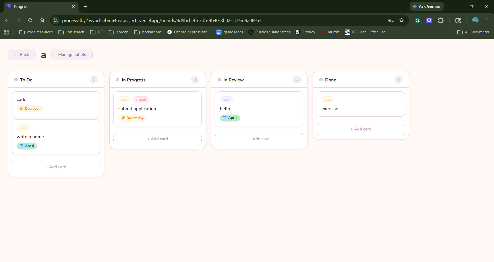

# Progess

A Kanban TaskBoard app with boards, cards, and labels. Built with React and Supabase.

🔗 **Live demo:** [progess-psi.vercel.app](https://progess-psi.vercel.app)

---

## Features

- **Boards** — create and manage multiple project boards
- **Cards** — add, move, and organize cards across columns
- **Labels** — color-coded custom labels with role-based permissions
- **Due Dates** — assign due date for cards
- **Authentication** — user sign-up and login via Supabase Auth
- **Real-time** — changes reflect across sessions using Supabase

---

## Demo

**Login Page**


**Main Window**


**Board Page**


---

## Tech Stack

| Layer | Technology |
|-------|-----------|
| Frontend | React, CSS |
| Database | Supabase (PostgreSQL) |
| Auth | Supabase Auth |
| Deployment | Vercel |

---

## Project Structure

```
Progess/
├── client/         # React frontend
├── server/         # Not active, for future use
└── vercel.json     # Vercel deployment config
```

---

## Getting Started

### Prerequisites

- Node.js 18+
- A [Supabase](https://supabase.com) project

### 1. Clone the repo

```bash
git clone https://github.com/lebm646/Progess.git
cd Progess
```

### 2. Set up the client

```bash
cd client
npm install
```

### 3. Run locally

```bash
npm run dev
```

### Deployment

The app is deployed on Vercel.